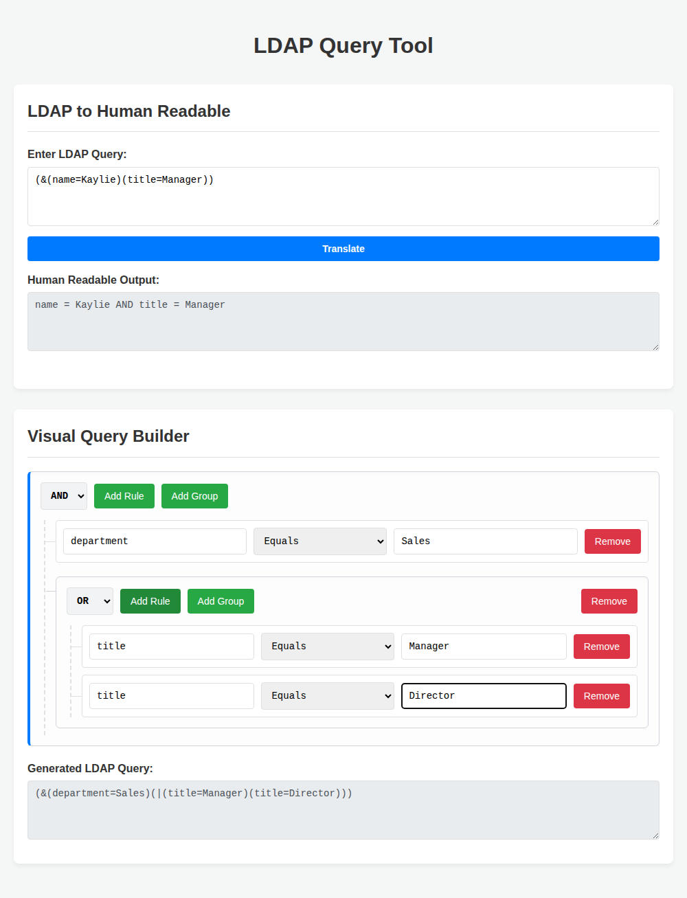

# LDAP Query Tool

A simple, lightweight, zero-build web interface to translate and construct LDAP queries.

## Features

This tool is split into two distinct, standalone sections:

1. **LDAP to Human Readable Translation:**
   - Parses standard RFC 4515 LDAP query strings (supporting `&`, `|`, `!`, `=`, `~=`, `>=`, `<=`, and wildcards `*`).
   - Translates complex, deeply nested queries into intuitive, plain-text sentences (e.g., `(&(name=Kaylie)(title=Manager))` becomes `name = Kaylie AND title = Manager`).
   - Automatically handles grouping via parentheses to ensure logic remains unambiguous.

2. **Visual Query Builder:**
   - Provides an infinitely chainable UI to create complex LDAP queries without needing to know the syntax.
   - Users can nest logical groups (AND, OR, NOT) and add multiple rules (Fields, Operators, Values) to each group.
   - Instantly generates valid LDAP query strings based on the visual layout.

## Tech Stack
Built using standard HTML, CSS, and Vanilla JavaScript with no external dependencies or build steps required. Simply open `index.html` in your browser to use the tool!

## Preview

